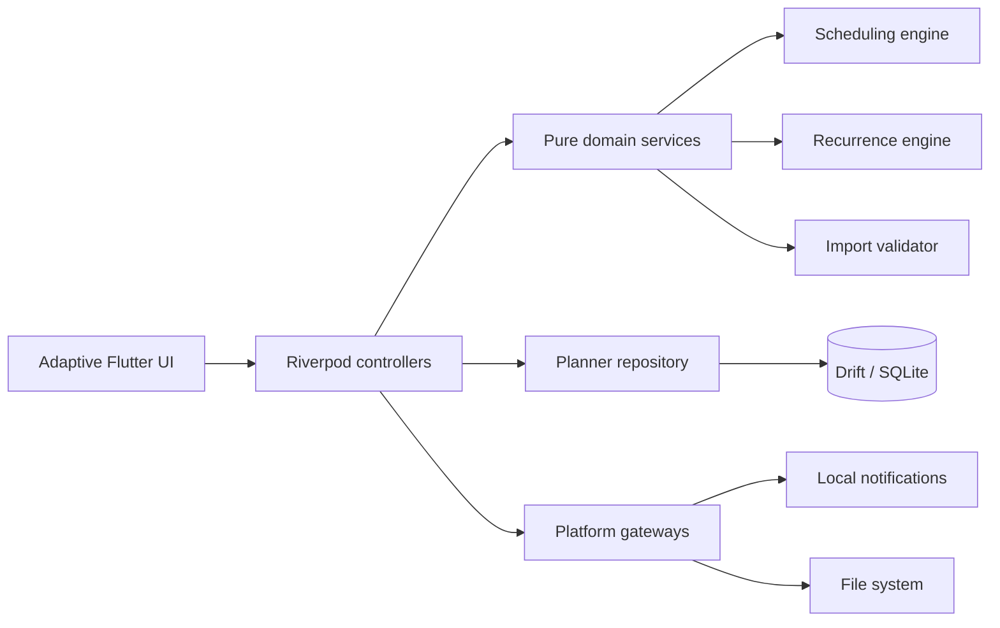

<div align="center">
  

  <h1>Anydoes</h1>

  <p><strong>An offline-first, duration-aware personal planner built for realistic scheduling.</strong></p>

  <p>
    
    
    
    
    
    
  </p>

</div>

---

## Why Anydoes?

Most task managers record _what_ needs doing. Anydoes also reasons about _when_ the work can happen.

Tasks can include duration estimates, deadlines, priorities, recurrence rules, availability constraints, assignees, and split-session limits. A deterministic scheduling engine turns those constraints into an editable proposal—without writing anything to the calendar until the user accepts it.

|         100 automated tests         |    7 visual baselines    |     3 adaptive layouts     | 90-day recurrence window | 0 required accounts |
| :---------------------------------: | :----------------------: | :------------------------: | :----------------------: | :-----------------: |
| Domain, data, UI, and accessibility | Calm Sky golden coverage | Phone, tablet, and desktop |   Rolling and bounded    |  Local by default   |

## From intention to schedule

1. **Capture** — Add a title instantly, then enrich it with duration, priority, dates, tags, subtasks, recurrence, or an assignee.
2. **Plan** — Rank work deterministically and fit it around availability, exceptions, fixed events, and locked blocks.
3. **Review** — Move, resize, remove, or lock suggested sessions while the proposal remains ephemeral.
4. **Commit** — Accept individual blocks or the complete plan in a single transactional update.

When work cannot fit, Anydoes reports the missing time and offers concrete recovery actions instead of silently producing an impossible calendar.

## Core capabilities

| Plan intelligently                                                                             | Stay in control                                               |
| ---------------------------------------------------------------------------------------------- | ------------------------------------------------------------- |
| Duration-aware scheduling with a deterministic 50/30/20 deadline, priority, and duration score | Proposals remain unsaved until explicitly accepted            |
| Split long tasks into legal sessions within weekly availability                                | Move, resize, remove, lock, skip, or complete schedule blocks |
| Respect fixed events, locked work, earliest starts, deadlines, and date exceptions             | Replan transactionally without disturbing manual decisions    |
| Surface exact conflicts and recovery options                                                   | Switch between responsive day and week planning views         |

| Organize deeply                                                             | Own your data                                                |
| --------------------------------------------------------------------------- | ------------------------------------------------------------ |
| Inbox, custom lists, tags, profiles, subtasks, search, and combined filters | Local Drift/SQLite persistence with no backend dependency    |
| Recurring tasks with bounded rolling materialization                        | Versioned and checksummed`.dayplan` backup and restore       |
| Local reminders for accepted blocks and deadline-only tasks                 | Isolated shared-list import/export with identifier remapping |
| Light, dark, high-contrast, and reduced-motion preferences                  | Validation completes before any import writes occur          |

## Engineering highlights

- **Pure scheduling core** — ranking, free-interval discovery, recurrence, canonical JSON, and import validation are isolated Dart services.
- **Transactional persistence** — multi-record operations such as plan acceptance, replanning, restore, and shared-list import are atomic.
- **Adaptive interface** — one codebase changes from bottom navigation to compact or extended navigation rails at defined breakpoints.
- **Failure-aware platform boundaries** — denied notification permissions or unavailable plugins never block task and schedule persistence.
- **Accessibility by design** — semantic labels, keyboard navigation, 48 px targets, 200% text support, high contrast, and reduced motion are covered by tests.
- **Deterministic verification** — fixed clocks, in-memory databases, fake platform gateways, golden baselines, and reproducible acceptance criteria keep behavior testable.

## Technology

| Layer              | Technology                                         | Responsibility                                                             |
| ------------------ | -------------------------------------------------- | -------------------------------------------------------------------------- |
| Interface          | **Flutter · Material 3**                           | Responsive Calm Sky UI across mobile, web, and desktop                     |
| Language           | **Dart 3.12+**                                     | Null-safe application and domain logic                                     |
| State management   | **Riverpod**                                       | Dependency injection, feature controllers, and reactive state              |
| Local persistence  | **Drift · SQLite**                                 | Typed queries, schema generation, and transactional storage                |
| Scheduling         | **Pure Dart services**                             | Ranking, interval discovery, proposals, and recurrence                     |
| Device integration | **flutter_local_notifications · flutter_timezone** | Local reminder reconciliation and named time zones                         |
| Portability        | **file_selector · path_provider · crypto**         | Cross-platform`.dayplan` files and SHA-256 integrity checks                |
| Testing            | **flutter_test · mocktail · golden tests**         | Domain, repository, widget, responsive, accessibility, and visual coverage |

## Architecture



The domain layer depends on repository and platform interfaces rather than concrete plugins. Drift implements local persistence, while notification, time-zone, and file adapters stay at the application boundary. This keeps the scheduling rules portable and straightforward to test without a device.

<details>
<summary><strong>Project structure</strong></summary>

```text
lib/
├── app/                  # Theme, providers, and adaptive navigation
├── core/                 # Shared layout, result, time, and widget utilities
├── data/
│   ├── database/         # Drift schema and generated database code
│   ├── notifications/    # Local notification adapters and reconciliation
│   ├── portability/      # .dayplan file integration
│   └── repositories/     # Transactional planner repository
├── domain/
│   ├── models/           # Planner entities and preferences
│   ├── portability/      # Codec, canonical JSON, and validation
│   ├── recurrence/       # Rolling recurrence materialization
│   └── scheduling/       # Ranking and schedule generation
└── features/             # Plan, tasks, profiles, and settings modules

test/
├── accessibility/        # Semantics, targets, keyboard, and text scaling
├── data/                 # Repository and notification integration tests
├── domain/               # Pure scheduling, recurrence, and codec tests
├── features/             # Controller and workflow widget tests
├── goldens/              # Seven Calm Sky visual baselines
└── responsive/           # End-to-end workflows at three breakpoints
```

</details>

## Platform support

| Target  | Repository status | Notes                                                                      |
| ------- | :---------------: | -------------------------------------------------------------------------- |
| Android |    Configured     | Native runner, launcher assets, and signing helper included                |
| Web     |     Verified      | Debug build and Wasm dry run pass; notifications depend on browser support |
| Windows |    Configured     | Requires Visual Studio with the Desktop development with C++ workload      |
| Linux   |    Configured     | Requires the standard Flutter Linux desktop toolchain                      |
| macOS   |    Configured     | Requires the standard Flutter macOS desktop toolchain                      |
| iOS     |  Not configured   | No iOS runner is included in this checkout                                 |

## Getting started

### Prerequisites

- Flutter SDK with **Dart 3.12 or newer**
- A configured toolchain for your chosen target

### Run locally

```powershell
git clone https://github.com/jrpbone/Anydoes.git
cd Anydoes
flutter pub get
dart run build_runner build --delete-conflicting-outputs
flutter run
```

List available targets with `flutter devices`, then select one explicitly when needed:

```powershell
flutter run -d <device-id>
```

### Build

```powershell
flutter build apk
flutter build web
flutter build windows
```

Drift-generated sources are committed. Rerun code generation after changing a table or generated query.

## Local-first data and portability

Anydoes stores its Drift database in platform-managed application storage; web builds use browser-managed local storage. There is no account requirement or remote scheduler. Clearing app/browser data or uninstalling the application may remove the database, so important plans should be exported first.

The `.dayplan` format is UTF-8 JSON with a schema version, document kind, source time zone, metadata, and a SHA-256 checksum over its canonical payload. Restore operations validate the complete document before writing, and shared-list imports remap identifiers without exposing unrelated planner data.

## What this project demonstrates

Anydoes is an end-to-end example of product-minded Flutter engineering: non-trivial algorithm design, offline data architecture, transactional state changes, responsive cross-platform UI, accessibility, defensive platform integration, and layered automated testing—all delivered without relying on a backend to make the core experience work.

---

<div align="center">
  <sub>Built with Flutter, deliberate constraints, and respect for the user's time and data.</sub>
</div>
